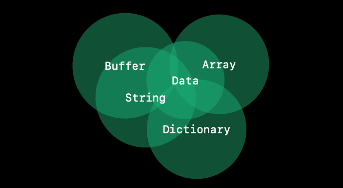
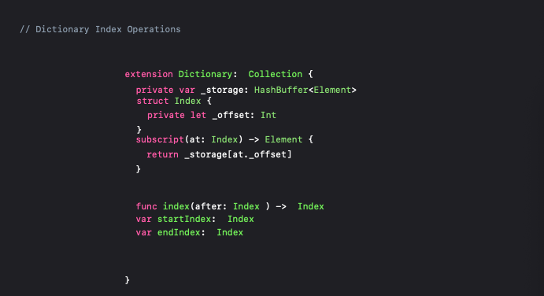
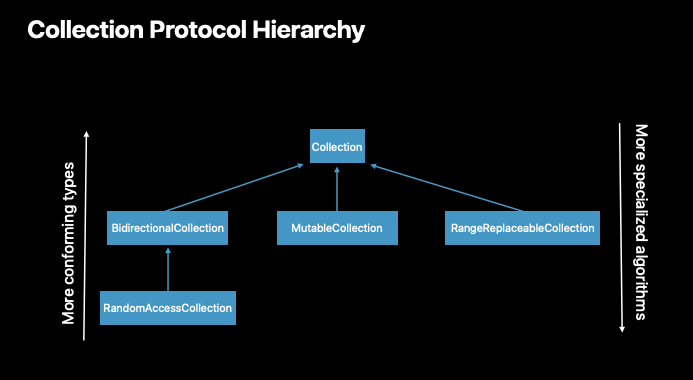
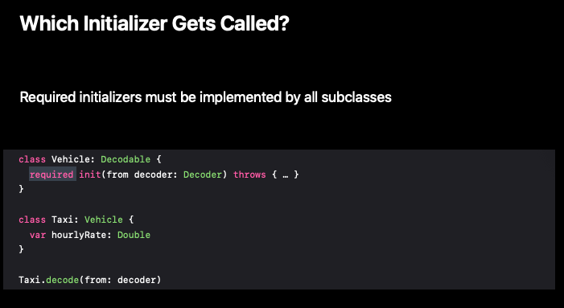

# Swift Generics (Expanded)

🎬 WWDC 2018 [Video](https://developer.apple.com/videos/play/wwdc2018/406/)

<br>

## Features of generics system

- What are generics?
- Protocol design
- Protocol inheritance
- Conditional conformance
- Classes and generics

<br>

## Why generics?

- To do

  - designing a simple collection, like type.
  - calling it buffer which is going to be similar to the standard library's array type.

- API

  - a count of the number of elements.

  - a way to fetch each element to the given position in the index.

    - subscript return `Any` 

      ```swift
      struct Buffer {
        var count: Int
        
        subscript(at: Int) -> Any {
          // get/set from storage
        }
      }
      ```

      - have to get out that type from inside the box 👉 error-prone.
      - by accident, an integer can be put into what was supposed to be a buffer of strings.

      ```swift
      var words: Buffer = ["substyping", "ftw"]
      words[0] as! String // I know this array contains strings
      words[0] = 42 // Uh-oh, now it doesn't
      ```

      - some problems relating to how these values are represented in memory. a lot of overhead in tracking, boxing, and unboxing the types in that Any.

- **Parametric Polymorphism**

  ```swift
  struct Buffer<Element> {
    let count: Int
    
    subscript(at: Int) -> Element {
      // fetch from storage
    }
  }
  ```

  - no need to do conversions when you're getting a type out of the buffer.
  - no accidental assignment of the wrong kind of type 👉 The complier will catch!
  - no such type as buffer without an associated element type.
    - a compliation error happens, when trying to declare a Buffer without Element type.
  - can hold all of the elements in a contiguous block of memory, with no overhead.

<br>

## Protocol design



- Important to think
  - What do those types have in common?
  - What don't they have in common?

<br>

Let's start to flesh out the collection protocol.

```swift
protocol Collection {
  
}
```

<br>

1. Element type

   - Use an associated type. `associatedtype Element`
   - Nice side benefit of giving generic arguments meaningful names that follow common conventions like the word element.

2. Subscript operation

   - Subscript which takes an `Int` would imply a very strong contract.

     - It works for great for types like array.

     - But, not for types like dictionary which is backed by some fairly complicated internal data structure.

       

       - so instead we want the dictionary to control moving forward through the collection by advancing the index. We need also a start index property, and an end index property.

     - add another associated type `assicatedtype Index`

3. Count

   - Put constraint on index-associated type

   - It means that all types that conform to the protocol need to supply an equatable type for their index.

     ```swift
     protocol Collection {
       associatedtype Element
       associatedtype Index: Equatable
     }
     
     // it's easy for dictioinary to make its index type equatable.
     extension Dictionary.Index: Equatable { }
     ```

<br>

## Protocol inheritance

- The protocol `Collection` is not enough!

- Some collection algorithms need more than `Collection` provides.

  - `lastIndex(where:)` needs to walk backwards to be efficient.

    👉 `BidirectionalCollection`

  - `shuffle()` needs to swap elements to work at all.

    👉 `RandomAccessCollection`

- Inheritance describes additional requirements for a subset of conforming types.

  - `SinglyLinkedList` cannot conform to `BidirectionalCollection`

- Use Inheritance to provide more-specialized algorithms.

- 🚨 **Anti-pattern**

  - Do not package it up into a protocol that is just that one **describes that one algorithm**. This leads lots and lots and lots of protocols around that don't have any interesting meaning.

- Keep distance capabilities separate.

  - Then, clients can compose multiple protocols.

  - Protocol hierarchies

    

    - ⬆️ Fewer requirements. More conforming types that can implement those requirements
    - ⬇️ More intricate, more specialized algorithms that require more advanced capabilities.

<br>

## Classes and generics

- Swift also supports object-oriented programming.
- Liskov substitution principle.
  - If S is a subtype of T, any instance of type T can be replaced by an instance of S.

- Protocol conformances are inherited by subclasses.

- A single conformance must work for *all* subclasses.

- However, there are some cases where this actually adds new requirements on the subclasses.

  - The most common one is when dealing with initializer requirements.

  - `Decodable` protocol

    ```swift
    protocol Decodable {
    	init(from decoder: Decoder) throws
    }
    
    extension Decodable {
      static func decode(from decoder: Decoder) throws -> Self {
        return try self.init(from: decoder)
      }
    }
    ```

    - It returns `Self` with a capital S.
    - It calls the initializer above to create a brand-new instance of whatever decodable type we have, and then return it.
      - When `Vehicle` conforms to the `Decodable`, the static method knows how to decode all of the state of a Vehicle. But! it knows nothing about the `Taxi` subclass.

    - So, it needs to be marked **required**.

      - It means that when Taxi inherits from Vehicle, it also needs to introduce an initializer with the same name.

      

    - `final` classes are exempt from these rules.

      - Final classes have no subclasses.
      - use `final` when your class is not customizable *through inheritance*.

<br>

## Summary

- Swift's generics provide **code reuse** while maintaining **static type** information.
- Let the push-pull between generic algorithms and conforming types guide design.
  - **Protocol inheritance** captures **specialized** capabilities of some conforming types.
  - **Conditional conformance** provides **composition** for those capabilities.
- Apply the Liskov Substitution Principle when working with classes.