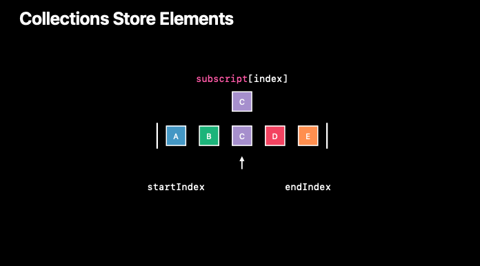
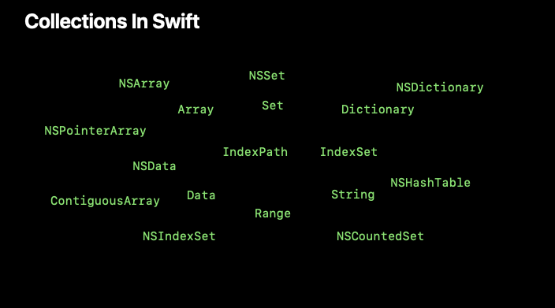
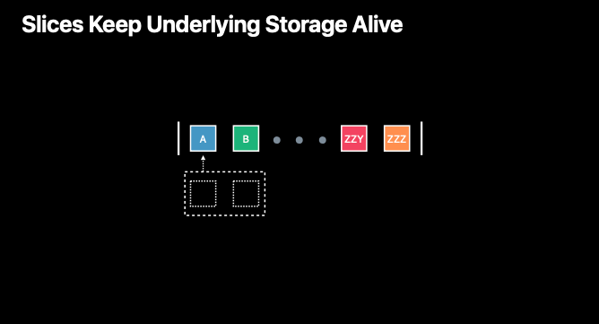
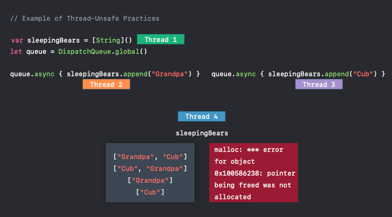
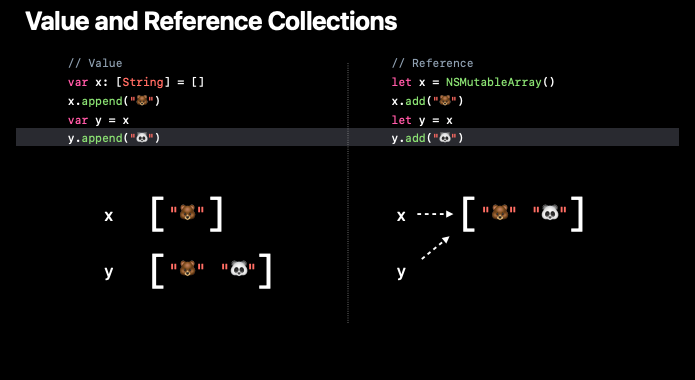
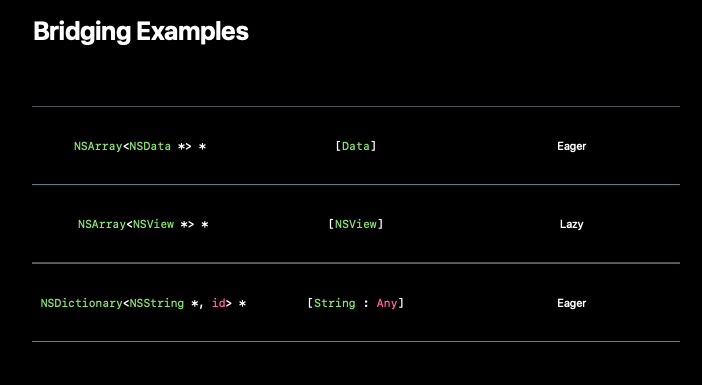

# Using Collections Effectively

🎬 WWDC 2018 [Video](https://developer.apple.com/videos/play/wwdc2018/229/)

<br>

- Fundamentals
- Indices and Slices
- Lazy
- Mutability and Multithreading
- Foundation and Bridging

<br>

## Declaration of Collection



```swift
protocol Collection: Sequence {
  associatedtype Element
  associatedtype Index: Comparable
  
  subscript(position: Index) -> Element { get }
  
  var startIndex: Index { get }
  var endIndex: Index { get }
  
  func index(after i: Index) -> Index
}
```

<br>



Thanks to the general purpose utility of these protocols, many other types conform to these collection protocols as well, such as data, range, and string.

<br>

## Indices

- Each collection defines its own index
- Must be `Comparable`
- Think of these as opaque

<br>

### ❓What is the first element of an Array

```swift
array[0]
array[array.startIndex] // 🚫 Fatal error: Index out of range
```

### ❓What is the first element of a Set

```swift
set[0] // 🚫 cannot subscript a value of type 'Set' with a index of type 'Int'
```

### ✅ first!

```swift
array.first
set.first
```

###❓What is the second element of a Collection

```swift
extension Collection {
  var second: Element? {
    // Is the collection empty?
    guard self.startIndex != self.endIndex else { return nil }
    // Get the second index
    let index = self.index(after: self.startIndex)
    // Is that index valid?
    guard index != self.endindex else { return nil }
    // Return the second element
    return self[index]
  }
}
```

<br>

## Slices

- Produce `Collection`-like peers of original collection

  - Array 👉 ArraySlice
  - String 👉 Substring
  - Set 👉 Slice\<Set>
  - Data 👉 Data
  - Range 👉 Range

- Slices keep underlying storage alive

  

- Eager vs. Lazy 

  - Eager functions

    ```swift
    let items = (1...4000).map { $0 * 2 }.filter { $0 < 10 }
    ```

  - Lazy functions

    ```swift
    let items = (1...4000).lazy.map { $0 * 2 }.filter { $0 < 10 }
    ```

    1. 1...4000
    2. LazyCollection<Range\<Int>>
    3. LazyMapCollection<Range\<Int>>
    4. LazyFilterCollection<LazyMapCollection\<Range\<Int>>>

    > Advice: When to Be Lazy?
    >
    > - Chained computation
    > - Only need part of a result
    > - No side effects
    > - Avoid API boundaries

<br>

## Mutability and Multithreading

Why did this collection code crash ⁉️

- Mutable Collection
- Range Replaceable Collections

<br>

✔️ Follow-Up Questions

- Are you mutating your colletion?

- Are your collections accessed from multiple threads?

  - Our collections optimized for single-threaded access

  

<br>

## ✔️ Advice

### Indices and Slices

- Use caution when keeping indices/slices
- Mutation invalidates
- Calculate only as needed

<br>

### Multithreading 

- Prefer state accessible from **a single thread**
- When this is not possible:
  - Ensure mutual exclusion
  - Use TSAN (ThreadSanitizer)

<br>

### Prefer Immutable Collections

- Easier to reason about data that can't change
- Less surface area for bugs
- Emulate mutation with slices and lazy
- The complier will help you

<br>

### Forming New Collections

- Use capacity hints if possible

  ```swift
  Array.reserveCapacity(_:)
  Set(minimumCapacity:)
  Dictionary(minimumCapacity:)
  ```

<br>

## Foundation Collections



<br>

### Objective-C APIs in Swift

```objective-c
@interface NSView
@property NSArray<NSView *> *subviews;
@end
```

```swift
class NSView {
  var subviews: [NSView]
}
```

<br>

## Bridging

- Converts between runtime types
- Bidirectional
- Bridging of collections
  - is necessary
  - can be cheap, but is never free

- Two kinds of bridging

  - **Eager** when element types are bridged
  - Otherwise **lazy**, bridged on first use

  

<br>

### Identifying Bridging Problems

- Measure your performance with Instruments
- Especailly inside loops at language boundaries
- Look for hotspots like:
  - `_unconditionallyBridgeFromObjectiveC`
  - `bridgeEverything`

<br>

## ✔️ Advice

### When to Use Foundation Collections

- You need reference semantics
- You are working with known proxies
  - `NSAttributedString.string`
  - Core Data Managed Objects
- You've measured and identified bridging costs