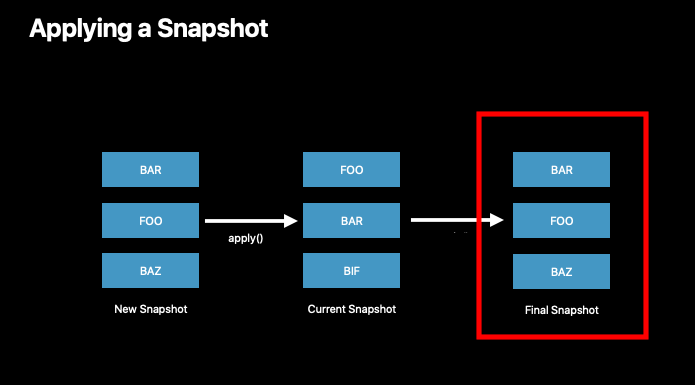

# Advances in UI Data Source

🎬 WWDC 2019 [Video](https://developer.apple.com/videos/play/wwdc2019/220/)

<br>

- Our data source and current UI state must always agree
- Current approach is error prone

<br>

## Diffable Data Source

- ❌ `performBatchUpdates()`
  - Crashing, hassles, complexity
- ✅ `apply()` 
  - Simple, automatic diffing

<br>

- UICollectionViewDiffableDataSource
- UITableViewDiffableDataSource
- NSCollectionViewDiffableDataSource

- **NSDiffableDataSourceSnapshot**

<br>

## Snapshots

- Truth of UI state
- Unique identifiers for sections and items
- No more IndexPaths



<br>

## Constructing Snapshots

- Empty snapshot

  ```swift
  let snapshot = NSDiffableDataSourceSnapshot<Section, UUID>()
  ```

- Current data source snapshot copy

  ```swift
  let snapshot = dataSource.snapshot()
  ```

<br>

- Snapshot state

  ```swift
  var numberOfItems: Int { get }
  var numberOfSections: Int { get }
  var sectionIdentifiers: [SectionIdentifierType] { get }
  var itemIdentifiers: [ItemIdentifierType] { get }
  ```

- Configuring snapshots

  ```swift
  func insertItems(_ identifiers: [ItemIdentifierType], beforeItem beforeIdentifier: ItemIdentifierType)
  func moveItem(_ identifier: ItemIdentifierType, afterItem toIdentifier: ItemIdentifierType)
  func appendItems(_ identifiers: [ItemIdentifierType], toSection sectionIdentifier: SectionIdentifierType? = nil)
  func appendSections(_ identifiers: [SectionIdentifierType]) 
  ```

<br>

## Identifiers

- Must be unique
- Conforms to **Hashable**
- Data model or identifier

```swift
struct MyModel: Hashable {
  let identifier = UUID()
  func hash(into hasher: inout Hasher) {
		hasher.combine(identifier)
  }
  static func == (lhs: MyModel, rhs: MyModel) -> Bool {
    return lhs.identifier == rhs.identifier
  }
}
```

<br>

## Performance

- Fast
- Measure your app
- **Safe to call `apply()` from a background queue**
  - Always call exclusively from the main queue or a background queue

<br>

## Demo - Share Sheet Adoption


