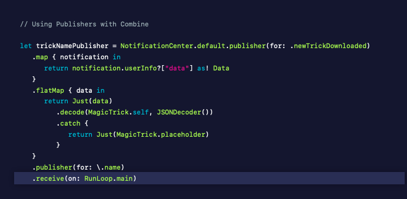
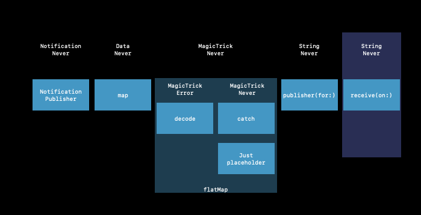
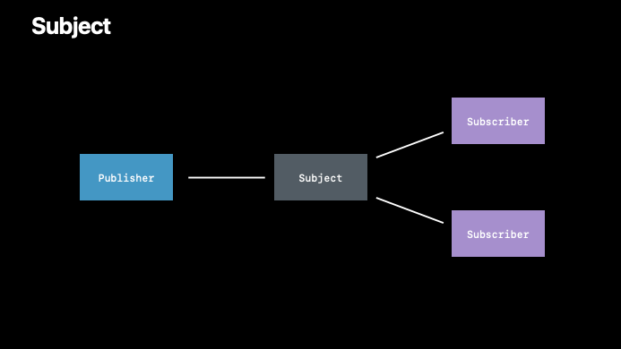
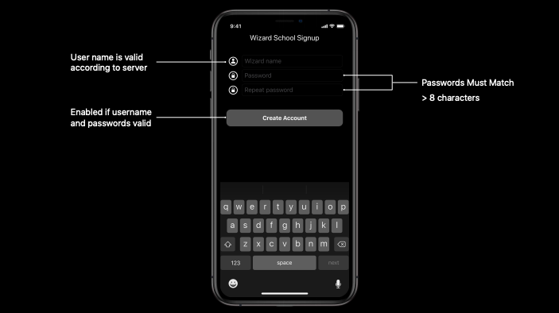
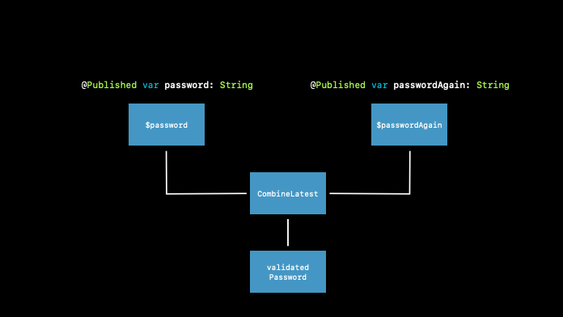
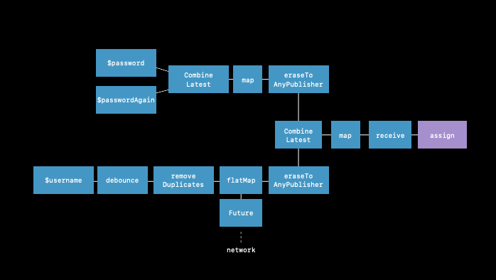

# Combine in Practice

🎬 WWDC 2019 <a href="https://developer.apple.com/videos/play/wwdc2019/721/">[Video]</a> 

<br>

## Publisher

☑️ To do

- let users read magic tricks that have been shared by wizards

<br>

```swift
let trickNamePublisher = Notification.default.publisher(for. newTrickDownloaded)
  .map { notification in
    return notification.userInfo["data"] as! Data
  }
  .decode(MagicTrick.self, JSONDecoder())
  // ✅ Ouput - MagicTrick
  // 💣 Failure - Error
```

<br>

### Error Handling

- Every `Publisher` describes how they can fail
- Use operators to react/recover from errors

- Failure Handling Operators
  - assertNoFailure <a href="https://developer.apple.com/documentation/combine/publisher/3204686-assertnofailure">[docs]</a>
    - assert that failure can never hanppen
    - if an error happens, app will crash
  - retry <a href="https://developer.apple.com/documentation/combine/publisher/3204751-retry">[docs]</a>
  - **catch** <a href="https://developer.apple.com/documentation/combine/publisher/3204690-catch">[docs]</a>
    - call recovery closure which will produce a new Publisher
    - but, once we switch to the recovery pulisher, we're never going to receive value from the previous publisher.
  - mapError <a href="https://developer.apple.com/documentation/combine/publisher/3204719-maperror">[docs]</a>
  - setFailureType <a href="https://developer.apple.com/documentation/combine/publisher/3204753-setfailuretype">[docs]</a>

### Flat Map

Using the nested scope for the flapMap operator, we will return, we will decode, we will catch, **return that to the flatMap**.

```swift
.flatMap { data in
  return Just(data)
  .decode(MagicTrick.self, JSONDecoder())
  .catch {
    return Just(MagicTrick.placeholder)
  }
}
```

<br>

### Scheduled Operators

Scheduled operators help us describe **when and where a particular event is delivered**.

- delay <a href="https://developer.apple.com/documentation/combine/publisher/3204704-delay">[docs]</a>
- **debounce** <a href="https://developer.apple.com/documentation/combine/publisher/3204702-debounce">[docs]</a>
- throttle <a href="https://developer.apple.com/documentation/combine/publisher/3204760-throttle">[docs]</a>
- **receive(on:)** <a href="https://developer.apple.com/documentation/combine/publisher/3204743-receive">[docs]</a>
- subscribe(on:) <a href="https://developer.apple.com/documentation/combine/publisher/3204758-subscribe">[docs]</a>

```swift
.publisher(for: \.name) // produce a new Publisher via a type-safe key path
.receive(on: RunLoop.main) // make the value always be delivered on the main queue
```

<br>





<br>

<br>

## Subscriber

- Exactly One Subscription
- Zero or More Values
- At Most One Completion (or Failure)

<br>

```swift
let trickNamePublisher = ... // Publisher of <String, Never>
```

#### assign

Key path assignment.

```swift
let canceller = trickNamePublisher.assign(to: \.someProperty, on: someObject)
```

#### sink

Every value received, the closure's going to get called.

```swift
let canceller = trickNamePublisher.sink { trickName in
  // Do something with trickName
}
```

<br>

### Cancellation

- Built into Combine
- Terminate subscriptions early before a Publisher is done delivering events

```swift
protocol Cancellable {
  func cancel()
}

final class AnyCancellable: Cancellable {} // calls 'cancel' on deinit
```

<br>

### Subjects

```swift
protocol Subject: Publisher, AnyObject {
  func send(_ value: Output)
  func send(completion: Subscribers.Completion<Failure>)
}
```

- behave like both publisher and subscriber
- Broadcast values to multiple subscribers



<br>


#### 1. Passthough

- stores no value
- only can see values after you subscribe to the subject

#### 2. CurrentValue

- Maintains a history of the last value that it received
- new subscribers can catch up the value.

<br>

### Working with SwiftUI

- SwiftUI owns ths `Subscriber`
- You just need to bring a `Publisher`

<br>

#### BindableObject

```swift
protocol BindableObject {
  associatedtype PublisherType: Publisher where PublisherType.Failure == Never
  
  var didChange: PublisherType { get }
}
```

```swift
class WizardModel: BindableObject {
  var trick: WizardTrick { didSet { didChange.send() } }
  var wand: Wand? { didSet { didChange.send() } }
  
  let didChange: PassthroughSubject<Void, Never>()
}

struct TrickView: View {
  @ObjectBinding var model: WizardModel
  
  var body: some View {
    Text(model.trick.name)
  }
}
```

<br>

<br>

## Integrating Combine

Designed for **composition**

<br>



#### Three tasks

- User name should be valid according to server
- Passwords must match, and their lengths should be more than 8 characters
- Enable the button when username and passwords are valid

<br>

### @Published

- Property wrapper
- Adds a publisher to any property

<br>

### CombineLatest

A publisher that receives and combines the latest elements from two publishers.



```swift
@Published var password: String = ""
@Published var passwordAgain: String = ""

var validatedPassword: CombineLatest<Published<String>, Published<String, Strgin?> {
  return CombineLatest($password $passwordAgain) { password, passwordAgain in
    guard password == passwordAgain, password.count > 8 else { return nil }
    return password
  }
}
```

<br>

### Debounce

Publishes elements only after a specified time interval elapses between events.

```swift
@Published var username: String = ""

var validatedUsername: AnyPublisher<String, Never> {
  return $username
    .debounce(for: 0.5, scheduler: RunLoop.main)
    .removeDuplicates()
    .flatMap { username in
      return Future { promise in
      self.usernameAvailable(username) { available in
        promise(.success(available ? username : nil))
      }
    }         
  }
  .eraseToAnyPulisher()
}
```

- Network operation is not necessary every single time the user types a single character 👉 **debounce**
- No reason to hit the server again when the values at the end are same 👉 **removeDuplicates**

<br>

```swift
var validatedCredentials: AnyPublisher<(String, String)?, Never> {
  return CombineLatest(validatedUsername, validatedPassword) { username, password in
    gurad let uname = username, let pwd = password else { return nil }
    return (uname, pwd)
  }
  .eraseToAnyPublisher()
}
```

<br>

```swift
@IBOutlet var signupButton: UIButton!

var signupButtonStream: AnyCancellable?

override func viewDidLoad() {
  super.viewDidLoad()
  
  self.signupButtonStream = self.validatedCredentails
    .map { $0 != nil }
    .receive(on: RunLoop.main)
    .assign(to: \.isEnabled, on: signupButton)
}
```

<br>



From three very simple publishers, to just necessary strings.

<br>

### Use Combine Today

- Compose small parts into custom publishers
- Adopt incrementally
- Add a `Publisher` to a property with `@Published`
- Compose callbacks and Publishers with `Future`
