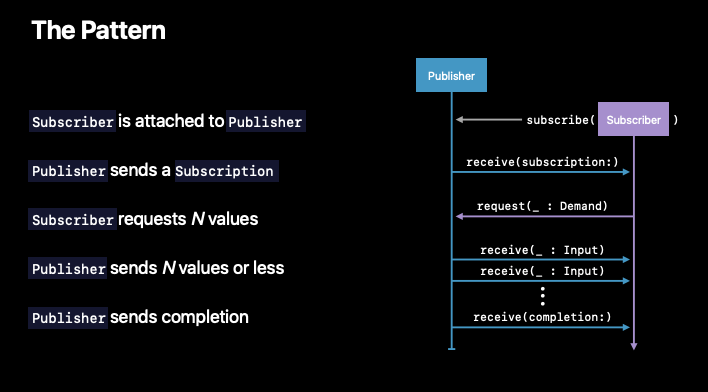
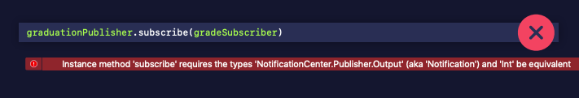
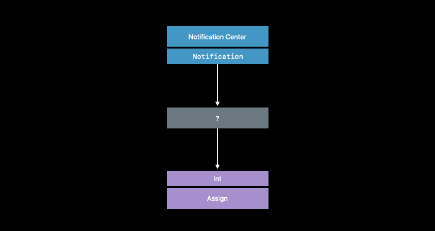
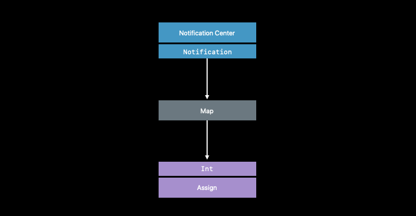
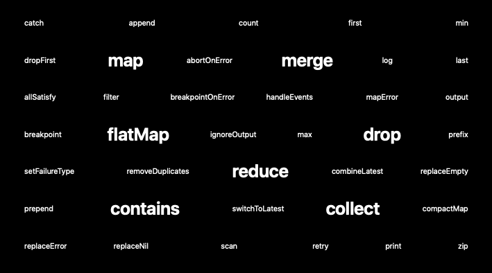
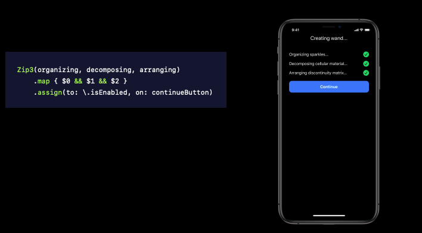
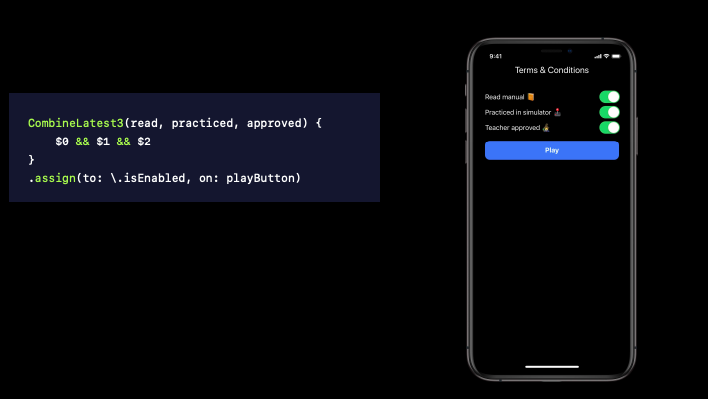

# Introducing Combine

🎬 WWDC 2019 [Video](https://developer.apple.com/videos/play/wwdc2019/722)

A unified, declarative API for **processing values over time**.

<br>

### Features

- Generic
- Type safe
- Composition first
- Request driven

<br>

### Key Concepts

- <a href="#-Publisher">Publishers</a>
- <a href="#-Subscriber">Subscribers</a>
- <a href="#-Operator">Operators</a>

<br>

## 📌 Publisher

- Defines how values and errors are produced
- Value type (*Struct*)
- Allows registration of a `Subscriber`

```swift
protocol Publisher {
  associatedtype Output
  associatedtype Failure: Error
  
  func subscribe<S: Subscriber>(_ subscriber: S) where S.Input == Output, S.Failure == Failure
}
```

##### NotificationCenter 

 `Publisher` 예시 (not replacing, just adapting)

```swift
extension NotificationCenter {
  struct Publisher: Combine.Publisher {
    typealias Output = Notification
    typealias Failure = Never
    init(center: NotificationCenter, name: Notification.Name, object: Any? = nil)
  }
}
```

<br>

## 📌 Subscriber

- Receives values and a completion
- Reference type (*Class*)

```swift
protocol Subscriber {
  associatedtype Input
  associatedtype Failure: Error
  
  func receive(subscription: Subscription)
  func receive(_ input: Input) -> Subscribers.Demand
  func receive(completion: Subscribers.Completion<Failure>)
}
```

##### Assign

`Subscriber` 예시

```swift
extension Subscribers {
  class Assign<Root, Input>: Subscriber, Cancellable {
    typealias Failure: Never
    init(object: Root, keyPath: ReferenceWritableKeyPath<Root, Input>)
  }
}
```

<br>

## Pattern

1. `Subscriber` is attached to `Publisher`
2. `Publisher` sends a `Subscription`
3. `Subscriber` requests *N* values
4. `Publisher` sends *N* values or less
5. `Publisher` sends completion




##### ☑️ To do

- Listening for a notification about my students graduating.
- Updating my model object's value, once they've graduated. 

```swift
class Wizard {
  var grade: Int
}
let merlin = Wizard(grade: 5)

let graduationPublisher = NotificationCenter.Publisher(center: .default, name: .graduated, object: merlin)
let graduationSubscriber = Subscribers.Assign(object: merlin, keyPath: \.grade)
```



##### 🚫 Complie Error 

- Types don't match.
  - Output: Notification
  - Input: Int



##### 🔄 How to Fix

- Something in the middle to **convert** between notifications and integers.

<br>

## 📌 Operator

- Adopts `Publisher`
- Describes a behavior for changing values
- Subscribes to a `Publisher` ("**upstream**")
- Sends result to a `Subscriber` ("**downstream**")
- Value type

##### Map

A struct that is initialized with which upstream it connects to and how to **convert** its **upstream's output** into **its own output**.

```swift
extension Publishers {
  struct Map<Upstream: Publisher, Output>: Publisher {
    typealias Failure: Upstream.Failure
    
    let upstream: Upstream
    let transform: (Upstream.Output) -> Output
  }
}
```



```swift
extension Publisher {
  func map<T>(_ transform: @escaping (Output) -> T) -> Publisher.Map<Self, T> {
    return Publishers.Map(upstream: self, transform: transform)
  }
}
```

```swift
let cancellable = NotificationCenter.default.publisher(for: .graduated, object: merlin)
	.map { note in
	   return note.userInfo?["NewGrade"] as? Int ?? 0
	}
	.assign(to: \.grade, on: merlin)
```

##### ✅ Fixed

- Once received a notification, it then map the notification as an integer.
- Then it can be assigned to the grade property on Merlin. 

<br>

### Declarative Operator API

- Functional transformations
- List operations
- Error handling
- Thread or queue movement
- Scheduling and time



```swift
let cancellable = NotificationCenter.default.publisher(for: .graduated, object: merlin)
	.compactMap { note in
  	   return note.userInfo["NewGrade"] as? Int 
  	}
	.filter { $0 >= 5 }
	.prefix(3)
	.assign(to: \.grade, on: merlin)
```

<br>

### Combining Publishers

- Zip
- CombineLatest

<br>

##### Zip

In the app before the user is allowed to continue, three **long-running asynchronous operations** should be finished. This is job for Zip.

- Converts several inputs into a single tuple
- A "when/and" operation
- Requires input from all to proceed



<br>

##### Combine Latest

- Converts several inputs into a single value
- A "when/or" operation
- Requires input from any to proceed
- Stores last value


