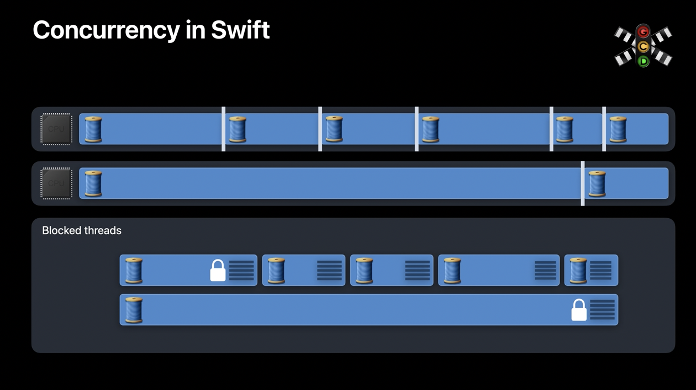
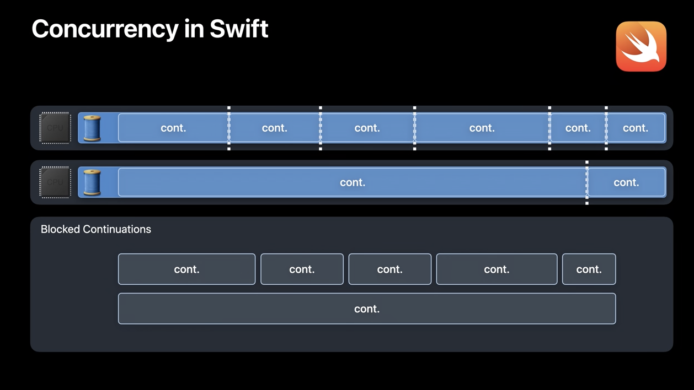

# Swift concurrency: Behind the scenes

- Theading model (in cotrast GCD)
- Synchronization (actors)


## Threading model

### Grand Central Dispatch



```swift
let urlSession = URLSession(configuration: .default, delegate: self,
                           delegateQueue: concurrentQueue)

for feed in feedsToUpdate {
  let dataTask = urlSession.dataTask(with: feed.url) { data, response, error in 
		guard let data = data else { return }
		do {
      let articles = try deserializeArticles(from: data)
      databaseQueue.sync {
        updateDatabase(with: articles)
      }
    } catch {
      /*...*/
    }
	}
  dataTask.resume()
}
```

- Having lots of threads -> what's so bad?
- Excessive concurrency
  - Overcommitting the system with more threads than CPU cores
    - iPhone has 6 cores
  - Thread explosion
    - Memory overhead
    - Scheduling overhead
      - Timesharing of threads
      - Excessive context switching
      - CPU runs less efficiently


### Swift Concurrency



- Runtime behavior
- Runtime contract 
  - Threads will not be blocked
- Language features
  - `await` and non-blocking of threads
  - tracking of dependencies in Swift task model

```swift
func deserializeArticles(from data: Data) -> [Article]
func updateDatabase(with articles: [Article], for feed: Feed) async

await withThrowingTaskGroup(of: [Article].self) { group in
	for feed in feedsToUpdate {
    group.async {
      let (data, response) = try await URLSession.shared.data(from: feed.url)
			let articles = try deserializeArticles(from: data)
      await updateDatabase(with: articles, for: feed)
      // ...
      return articles
    }
    // ...
  }
	// ...
}
```


